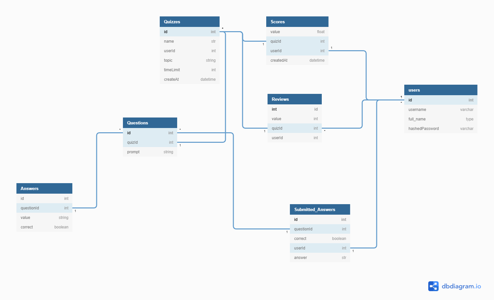

# Introduction

# Features
- 'Dontcha Know' is a web application that allows users to participate in user created quizzes. As well as create their own. A quiz will be allowed to be custom made allowing the creator to specify an alloted time per question, as well as an alloted time per quiz. The quizes will allow for multiple choice, match the term, and true or false.

- Another feature of the application is providing information about their attempts on quizzes as well as others attempts on theirs. This would include total attempts, who attempted, as well as recent scores, and average score.

# Technologies Used
Express Js / React

# Database Schema

